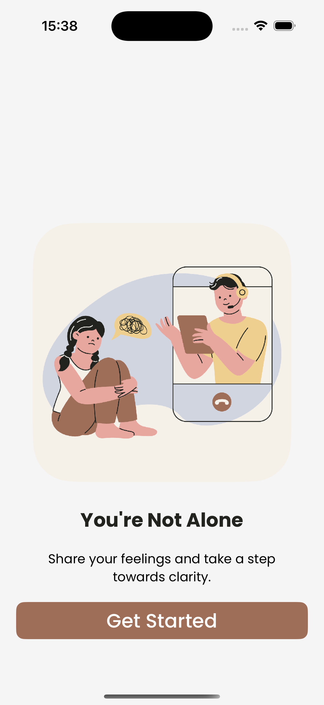
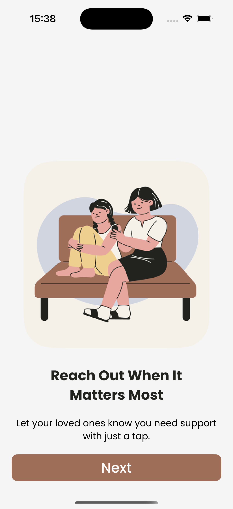
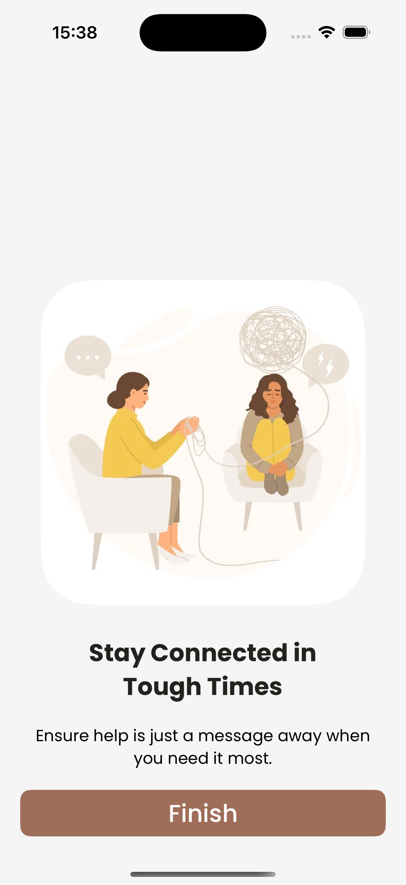
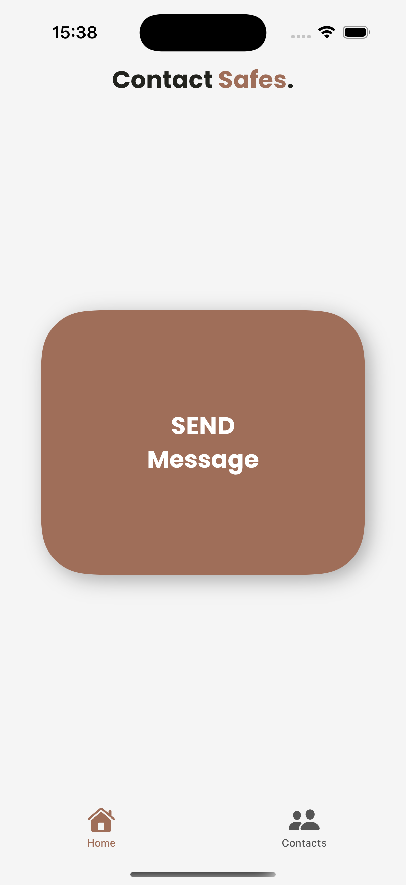
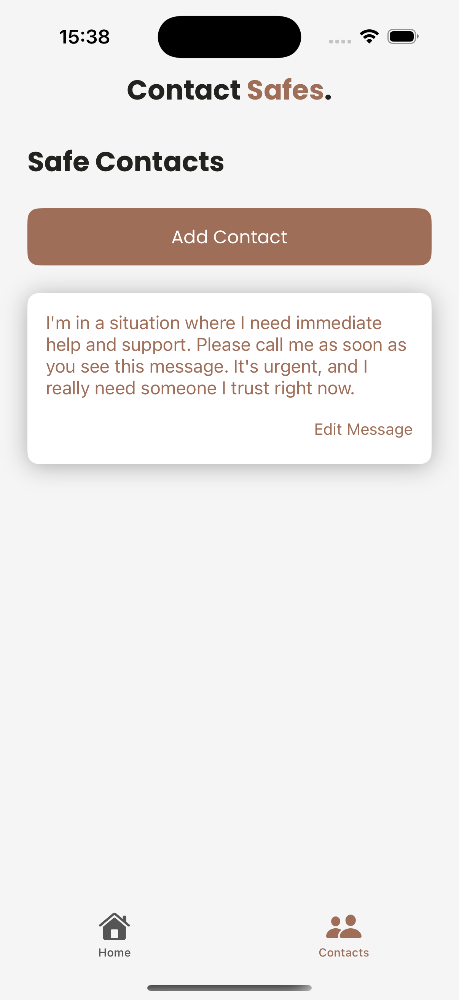
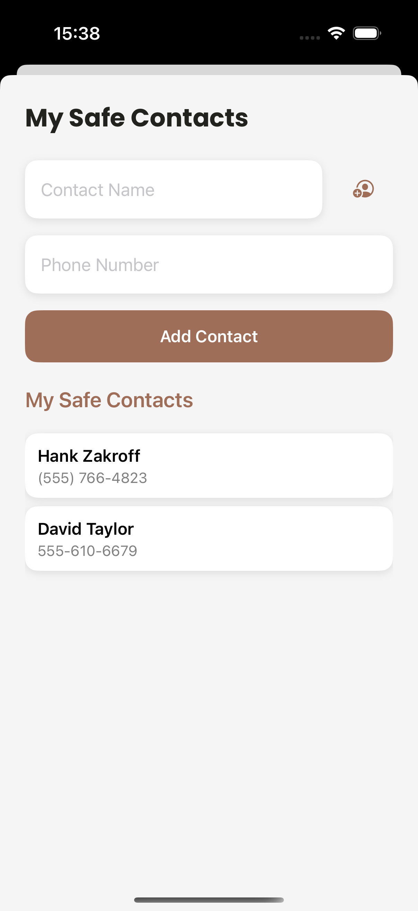
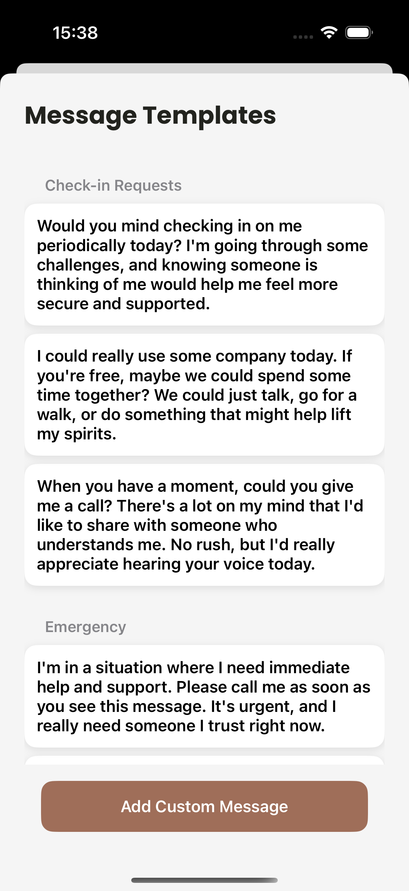

# ContactSafesApp Documentation

## Overview
ContactSafesApp is an iOS application designed to help users connect with their emergency contacts in times of need. The app provides a user-friendly interface for managing contacts and sending messages quickly and efficiently.

## Features
- **User Authentication**: Secure login and user management.
- **Contact Management**: Add, edit, and delete emergency contacts.
- **Message Sending**: Quickly send predefined messages to contacts.
- **Onboarding Process**: A guided onboarding experience for new users.
- **Theming**: Customizable themes for a personalized user experience.

## Screenshots
Here are some screenshots of the application:




*Onboarding Screen*


*Main Screen*


*My Contacts Screen*


*Add Contacts Screen*


*Message Screen*

## Installation
To install and run the ContactSafesApp, follow these steps:

1. Clone the repository:
   ```bash
   git clone https://github.com/Veliashvilii/ContactSafesApp.git
   ```
2. Navigate to the project directory:
   ```bash
   cd ContactSafesApp
   ```
3. Open the project in Xcode:
   ```bash
   open ContactSafesApp.xcodeproj
   ```
4. Build and run the project on a simulator or a physical device.

## Usage
1. Launch the app.
2. Follow the onboarding instructions to set up your profile.
3. Add your emergency contacts.
4. Use the message sending feature to quickly communicate with your contacts.

## Contributing
Contributions are welcome! Please follow these steps to contribute:

1. Fork the repository.
2. Create a new branch:
   ```bash
   git checkout -b feature/YourFeature
   ```
3. Make your changes and commit them:
   ```bash
   git commit -m "Add your message here"
   ```
4. Push to the branch:
   ```bash
   git push origin feature/YourFeature
   ```
5. Create a pull request.

## License
This project is licensed under the MIT License - see the [LICENSE](LICENSE) file for details.

## Contact
For any inquiries or support, please contact [metehanbelli8@gmail.com].
